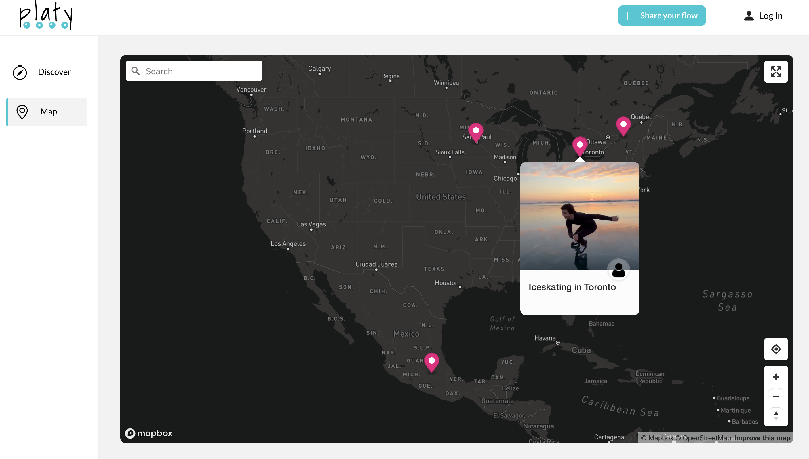

<div align="center" style="margin: 2rem 0;">

<h3>Share & Locate Skateflow Content</h3>
</div>

# About Platy

Platy is a MERN Fullstack Application where you can find places to go rollerblading. You can also watch clips from people around the world rollerblading. If you know a cool spot and want to share it with the community you can sing up, then go to __Share your flow__, drop a pin and attach to it a clip of you rollerblaing. [Take a look](https://platywebsite.netlify.app/).


<br>
<br>
<br>
<br>

# Backend Introduction

This is the backend of the application and it has been built around the REST API architectural constraints using Express for Node.js and MongoDB for database CRUD operations. To work with it check the information bellow. If you wish to check the frontend of this application instead, go to [Platy frontend](https://github.com/luisbermudez/platy-frontend). 

<br>

## Prerequisites

Make sure you have node and yarn installed. You can use the following commands and if installed, you will get their version.

```bash
node -v
yarn -v
```

<br>

## Clone and run the project

1. Clone this repository

```sh
git clone https://github.com/luisbermudez/platy-backend.git
```

2. Run yarn command inside the project directory

```sh
yarn
```

<br>

## Dependencies

- bcryptjs
- cloudinary
- cookie-parser
- cors
- dotenv
- express
- jsonwebtoken
- mongoose
- morgan
- multer
- multer-storage-cloudinary
  <br>

If you are missing any of the dependencies above, run: yarn add **name-of-dependency**. For instance, to add **bcryptjs** the command would be:

```bash
yarn add bcryptjs
```

## Scripts

Use yarn dev to get it running.

```sh
yarn dev
```

<br>
<br>

# REST API Introduction
This section will help you get familiar with the resources of this REST API and show you how to make different requests.

<br>
<br>

**BASE URL:** `https://platybend.herokuapp.com/api/`

All requests are `POST` requests and go over `https`. All responses will return data in `json`.

<br>
<br>

## Signup

You can signup using: `/signup`

```sh
post https://platybend.herokuapp.com/api/auth/signup
```

```sh
{
	"name": "Name",
	"email": "email@email.com",
	"password": "****",
	"confirmPassword": "****"
}
```

<br>
<br>

## Login

To login use: `/login`

```sh
post https://platybend.herokuapp.com/api/auth/login
```

```sh
{
	"email": "email@email.com",
	"password": "****"
}
```

<br>
<br>

## Logout

To logout use: `/logout`

```sh
post https://platybend.herokuapp.com/api/auth/logout
```

<br>
<br>

## Store a video in cloudinary

You can store a new video in cloudinary using: `/videolocations/upload`

```sh
post https://platybend.herokuapp.com/api/videolocations/upload
```

Must use Multipar form with name: `videoFile`

<br>
<br>

## Create a new video~location

You can create a new video~location with: `/videolocations/create`

```sh
post https://platybend.herokuapp.com/api/videolocations/create
```

```sh
{
	"user": {
		"_id": " * You will need the id of the user creating this resource"
	},
	"values": {
		"title": "Video title",
        "name": " * Name of the location, this value is optional"
		"description": "Video description",
	},
    "videoUrl": " * Video url - this project uses cloudinary to store the videos",
    "public_id": " * This id comes from cloudinary, every video has a unique public id"
    "coordinateLng": "Location longitude",
    "coordinateLat": "Location latitude"
}
```

<br>
<br>

## Get all the video~locations

Get the video~locations that belong to a given user: `/videolocations`

```sh
post https://platybend.herokuapp.com/api/videolocations
```

```sh
{
	"user": { "_id": " * You will need the id of the user" }
}
```

<br>
<br>

## Video~location's details

Get video~location details using: `/videolocations/details`

```sh
post https://platybend.herokuapp.com/api/videolocations/details
```

```sh
{
	"_id": " * You need the video~location's id"
}
```

<br>
<br>

## Update video~location

Update video~location details with: `/videolocations/update`

```sh
post https://platybend.herokuapp.com/api/videolocations/update
```

```sh
{
	"_id": " * You need the video~location's id",
    "values": {
		"title": "Video title",
        "name": " * Name of the location"
		"description": "Video description",
	}

}
```

<br>
<br>

## Delete video~location

Delete video~location with: `/videolocations/delete`

```sh
post https://platybend.herokuapp.com/api/videolocations/delete
```

```sh
{
	"_id": " * You need the video~location's id",
    "public_id": " * This id comes from cloudinary, every video has a unique public id"
}
```

<br>
<br>

## Important

Cross-Origin Resource Sharing has been setup for this backend to only accept requests from [Platy frontend](https://github.com/luisbermudez/platy-frontend).